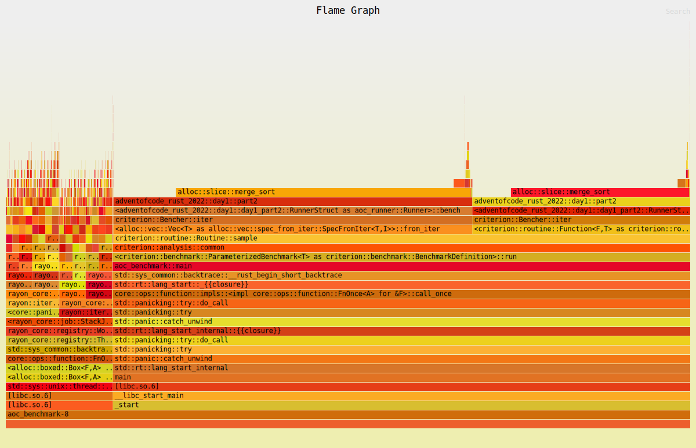

# Execution times for Advent of Code 2022
- 🎅 Solutions by [Artur Hallmann](https://github.com/arturh85)
- 🔖 [Github Repository](https://github.com/arturh85/adventofcode-rust-2022)
- 🚀 Benchmarked using [Github Actions](https://github.com/features/actions)
## Distribution of 0.75 ms

# 📅 [Day 1: Calorie Counting](https://adventofcode.com/2022/day/1)
- [Solution Source](https://github.com/arturh85/adventofcode-rust-2022/blob/master/src/day1.rs)
## Day 1 Part 1
### Result : 67450
	
- generator: 117.901µs 
	
- runner: 5.3µs

### [Flame Graph](flamegraph-day1-1.svg):

## Day 1 Part 2
### Result : 199357
	
- generator: 118.001µs 
	
- runner: 16.5µs

### [Flame Graph](flamegraph-day1-2.svg):

//! Day 2: Rock Paper Scissors ---
- [Solution Source](https://github.com/arturh85/adventofcode-rust-2022/blob/master/src/day2.rs)
## Day 2 Part 1
### Result : 12276
	
- generator: 200.002µs 
	
- runner: 39.101µs

### [Flame Graph](flamegraph-day2-1.svg):

## Day 2 Part 2
### Result : 9975
	
- generator: 219.703µs 
	
- runner: 33.5µs

### [Flame Graph](flamegraph-day2-2.svg):

